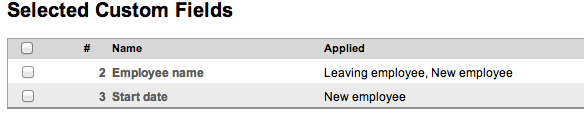
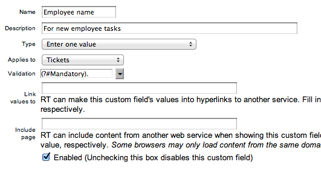
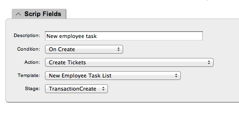
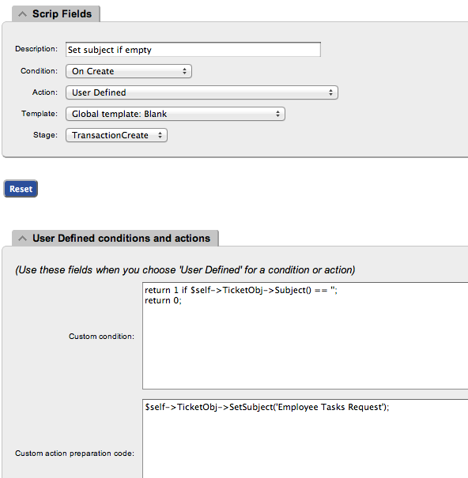

# @title Configure RequestTRacker

RT Setup
======================

[Up](CONFIG.md) | [Google](GOOGLE_SETUP.md) 

## Create Queue ##

For this setup foll wing queues are required:

- Admin

- New Employee

- Leaving  Employee

## Create Template With Unique Name ##

Each queue will need one template. Template name used for the SQL update statement, so please make sure that name is unique. Template name must correspond to that of Google Doc worksheet.

## Create Queue Custom Fields ##

Create custom fields for each queue and set Validation. In our case it is simply se to _Mandatory_.

* * * * *

### Employee Name ###

* * * * *

### Date Fields  ###

New employee and Leaving employee will need to have different date fields _Start date_ and _Leave date_ fields correspondingly.

* * * * *

## Link template with queue ##

## Create Scrip(s) ##

First script is required - it creates children tickets in queues. Without this script it will not work.

* * * * *

Second one is just a convenience scrip - it will set subject of the ticket if it was omitted.

Both queues are required to have these scripts, because they are queue specific.

* * * * *
